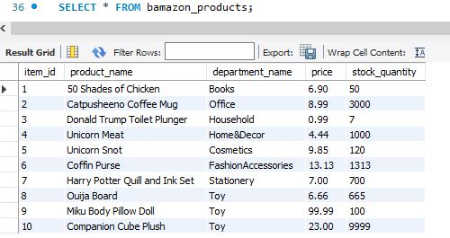

# mySQL-bamazon
###Languages and Technology Used: JSON, inquirer, node.js, mySQL, javascript

mySQL is used to create a Amazon-like storefront in which the user can deplete inventory by purchasing items. First an inventory database is made in mySQL workbench.

Next, the table is populated with 10 inventory items, each item has an ID, name, department, price and stock quantity.

Then, in node.js, the user would be shown the store catalogue when they input 'node bamazonManager.js' into the commad line. They can order an item by answering two prompts, which item they would like to buy and how many. The order is completed by answering the prompts. The total price is calculated and displayed. The user would then have the option of making another purchase.

The inventory stock has reduced by the user's purchased quantity.

If user's order quantity is larger than what is in stock, they will get be prompted to modify their order.

